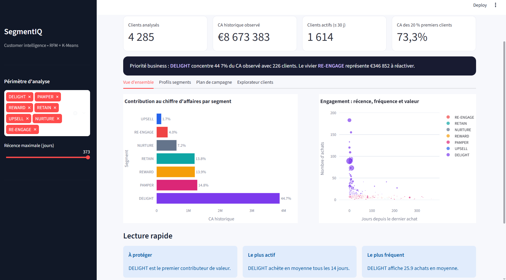
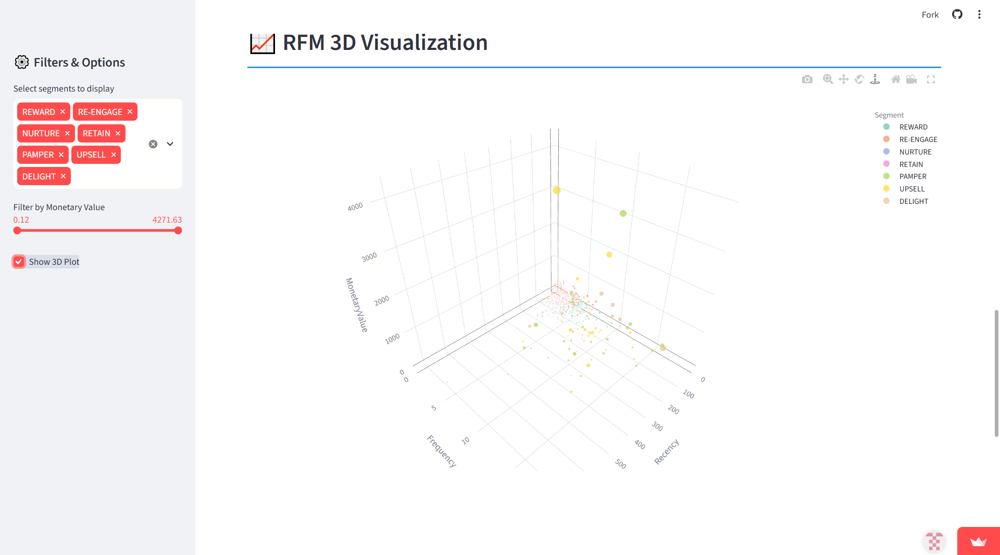
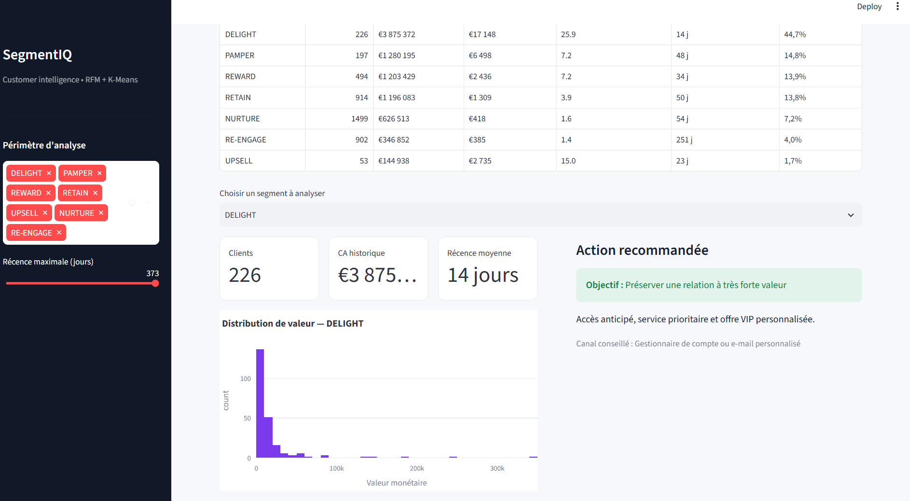

# 📊 SegmentIQ — Customer Segmentation Dashboard (RFM Analysis & K-Means)


**SegmentIQ** est un dashboard de **segmentation client** basé sur les données de transactions du dataset **Online Retail II** (UCI Machine Learning Repository), combinant **analyse RFM** (Recency, Frequency, Monetary) et **clustering K-Means**. Le dashboard exploite directement les résultats réels du clustering produit par le notebook d'analyse — aucune donnée n'est générée ou recalculée à la volée.

🔗 **Démo live** : [Tester l'application](VOTRE-LIEN-STREAMLIT)
📁 **Dataset** : [Online Retail II — UCI Machine Learning Repository](https://archive.ics.uci.edu/dataset/502/online+retail+ii) *(fichier Excel ~46MB, non inclus dans le repo — à télécharger et placer dans `data/`)*

---

## 🖼️ Aperçu


*4 285 clients analysés, 8,67 M€ de CA historique, 1 614 clients actifs (≤30j), et 73,3% du CA porté par les 20% meilleurs clients*


*Position de chaque client selon ses 3 variables RFM, filtrable par segment*


*Chaque segment dispose d'une fiche complète : nombre de clients, CA historique, panier moyen, fréquence, récence, part du CA total, et une action marketing concrète (ex: pour DELIGHT — "Préserver une relation à très forte valeur : accès anticipé, service prioritaire, offre VIP personnalisée")*


*Sélection d'un segment et téléchargement de son audience en CSV, prêt pour une campagne marketing*

---

## 🎯 Le défi

Segmenter une large base de transactions e-commerce pour identifier des groupes de clients avec des comportements d'achat distincts, tout en gérant correctement les **outliers** (clients atypiques à très haute ou très basse valeur) qui, non traités, auraient faussé le clustering.

## 🔧 Stack technique

| Composant | Outil |
|---|---|
| Langage | Python |
| Interface | Streamlit |
| Clustering | Scikit-learn (KMeans) |
| Méthode | RFM Analysis (Recency, Frequency, Monetary) |
| Visualisation | Plotly (3D interactif) |

## 🧭 Fonctionnalités du dashboard

L'application **SegmentIQ** est organisée en 4 onglets :

- **Vue d'ensemble** — 4 indicateurs clés (clients analysés, CA historique, clients actifs, part du CA des 20% meilleurs clients), contribution au CA par segment, et graphique d'engagement (récence × fréquence × valeur)
- **Profils segments** — fiche détaillée par segment (clients, CA, panier moyen, fréquence, récence) avec action marketing recommandée
- **Plan de campagne** — sélection d'un segment et export CSV de son audience, prêt pour une campagne
- **Explorateur clients** — tableau pour identifier et filtrer les clients prioritaires

Un filtre latéral (**Périmètre d'analyse**, **Récence maximale**) permet d'affiner la vue sur l'ensemble des pages.

## ⚙️ Démarche

1. **Chargement & exploration** — lecture du fichier Excel, statistiques descriptives, détection des problèmes de qualité de données
2. **Nettoyage des données** — filtrage des transactions valides, suppression des codes produits non-standards, gestion des Customer ID manquants, suppression des prix négatifs/nuls
3. **Feature engineering RFM** :
   - **Recency** : nombre de jours depuis le dernier achat
   - **Frequency** : nombre d'achats
   - **MonetaryValue** : dépense totale (Quantité × Prix)
4. **Gestion des outliers** — séparation des clients atypiques pour un clustering plus robuste
5. **Clustering** — normalisation des variables RFM (StandardScaler) puis application de **K-Means**, exécuté une seule fois dans le notebook et exporté dans `full_clustering_preprocessed.csv`
6. **Dashboard Streamlit** — lit directement ce fichier pour afficher les vrais résultats du clustering (aucun recalcul ni génération de données à la volée dans l'application)

## 📌 Segments identifiés

Analyse portant sur **4 285 clients**, pour un chiffre d'affaires historique observé d'environ **8,67 M€**. Les 20% meilleurs clients concentrent **73,3%** du CA total.

| Segment | Clients | CA historique | Panier moyen | Fréquence | Récence moy. | Part du CA |
|---|---|---|---|---|---|---|
| **DELIGHT** | 226 | €3 875 372 | €17 148 | 25.9 | 14 j | **44,7%** |
| **PAMPER** | 197 | €1 280 195 | €6 498 | 7.2 | 48 j | 14,8% |
| **REWARD** | 494 | €1 203 429 | €2 436 | 7.2 | 34 j | 13,9% |
| **RETAIN** | 914 | €1 196 083 | €1 309 | 3.9 | 50 j | 13,8% |
| **NURTURE** | 1 499 | €626 513 | €418 | 1.6 | 54 j | 7,2% |
| **RE-ENGAGE** | 902 | €346 852 | €385 | 1.4 | **251 j** | 4,0% |
| **UPSELL** | 53 | €144 938 | €2 735 | 15.0 | 23 j | 1,7% |

## 💡 Résultat & valeur business

- **DELIGHT** concentre à lui seul **44,7% du CA total** (3,88 M€) avec seulement 226 clients (5% de la base) — une priorité absolue pour la rétention, avec un service VIP dédié
- **RE-ENGAGE** représente 902 clients inactifs depuis **251 jours en moyenne** — le vivier de réactivation prioritaire, avec 346 852 € de valeur historique à remobiliser
- Cette segmentation transforme une base de transactions brute en **leviers marketing actionnables** : chaque segment dispose d'une action recommandée concrète et d'un export d'audience prêt à l'emploi depuis l'onglet Plan de campagne

> Une segmentation efficace commence par un nettoyage de données solide, suivi d'une compréhension approfondie du domaine métier.

## 🚀 Installation & utilisation

```bash
git clone https://github.com/imane-el-arrach/Customer-segmentation.git
cd Customer-segmentation

# Créer un environnement virtuel
python -m venv .venv

# Activer l'environnement
# Windows
.venv\Scripts\activate
# macOS/Linux
source .venv/bin/activate

# Installer les dépendances
pip install -r requirements.txt

# Lancer l'application
streamlit run app.py
```

> ⚠️ Le dashboard nécessite que `full_clustering_preprocessed.csv` existe (généré en exécutant le notebook au préalable) — il ne recalcule ni ne génère aucune donnée lui-même.
> Le dataset brut n'est pas inclus dans le repo (trop volumineux). Télécharge-le [ici](https://archive.ics.uci.edu/dataset/502/online+retail+ii) et place-le dans le dossier `data/`.

## 📂 Structure du projet

```
Customer-segmentation/
├── data/                                # Dataset brut (à télécharger, non versionné)
├── notebooks/                           # Notebook d'exploration et de clustering
├── full_clustering_preprocessed.csv     # Résultats réels du clustering (4 285 clients), lu par le dashboard
├── screenshots/                         # Captures utilisées dans ce README
├── app.py                               # Application Streamlit (SegmentIQ)
├── requirements.txt
└── README.md
```

